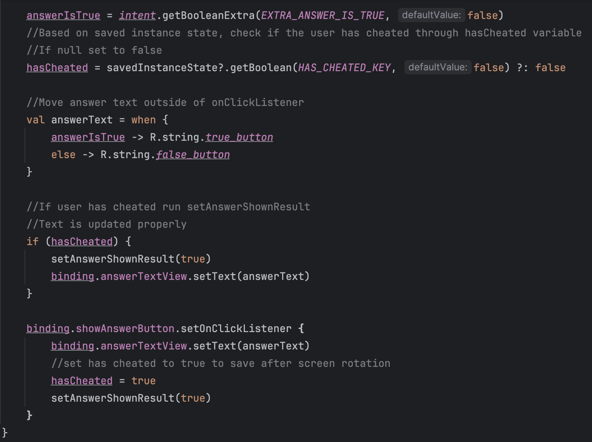
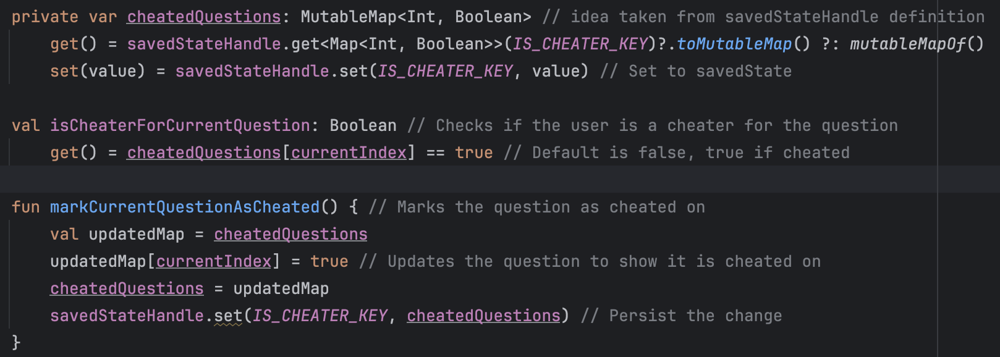

Zachary Rioux zdrioux@wpi.edu
Alex Samra ajsamra@wpi.edu
Kenyon Coleman kjcoleman@wpi.edu

Code is commented in the respective files and screenshots have been included in the descriptions below.
Part 1:
Two features needed to be completed during this stage. First was persisting CheatActivity's UI
    across rotation and process death. This was done in the CheatActivity.kt file.
     
    As seen in the screenshot, lines 33-57 were changed and commented. The saved instance state is 
    used to first see if the user has cheated, since the information is lost from the CheatActivity
    file when the rotation occurs. If this is null, then the user has not cheated, but otherwise the
    text is updated to continue to show the correct answer for the user that cheated. This will also
    update the hasCheated variable to true so that it shows the user cheated on the question. This means that
    if the user rotates back, then the answer will still be shown and it will state "Cheating is wrong"
    when the user tries to answer the question. This uses the idea talked about in class where we get
    the information saved before the rotation and resets the previous records in the onCreate function.
    
Second, the status of cheating needed to be a per question basis rather than as a whole during the quiz.
    
    This was achieved first by looking at the saved state handle to get the idea of a mutable map with an
    int for the question number and a boolean for the true or false value of if it has been cheated. All
    changes were made in the QuizViewModel.kt file. isCheaterForCurrentQuestion() and markCurrentQuestionAsCheated()
    are updated functions from before to now only check if a single question has been cheated on or 
    mark a single question, rather than the full quiz. In the MainActivity.kt file, these two updated
    functions needed to be called instead of the previous versions.

We are currently working on Part 2 and will be attempting the bonuses for both parts before next Friday's deadline.
